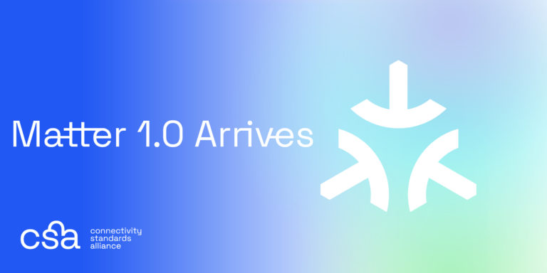

# Matter

최근 IoT 뉴스를 보는 사람이라면 Matter에 대해 들어본 적은 있을 것이다.  
본 포스팅에서는 Matter란 무엇인지에 대해 설명한다.  

## 홈 IoT하는데 왜 이렇게 뭐가 많은거야?

집에 홈 IoT를 구성 해본 사람들은 느낄 것이다. 일단 뭐가 많고 컨트롤러에 허브에 AI스피커 등등 주렁주렁 달고 나온다.  
하드웨어만 그런가? 소프트웨어도 제조사별 어플들 깔고 인증하고 GPS를 항상 켜야하고 등등 여러모로 세팅해야할 것이 많다.  
스마트폰 제조사에 따라도 음성인식 플랫폼에 각각 연결해야하는 등 번거러움이 더 많다. 
따라서 이를 통합하기 위해 **Matter**가 나왔다.  

## Matter가 도대체 뭔데?  

Matter는 기존 여러개로 정의되어있던 IoT 프로토콜들을 하나의 표준으로 묶는 **Application Layer**이다.  
Matter가 지원하는 프로토콜은 IP기반 네트워크이며 **WiFi**와 **Thread**를 지원한다. 추가적으로 저전력 블루투스(BLE)를 지원한다.  
Zigbee의 경우 Thread와 같은 주파수를 사용하지만 IP 프로토콜을 지원하지않아 지원 대상에 포함되지않았다.  

# 구조

