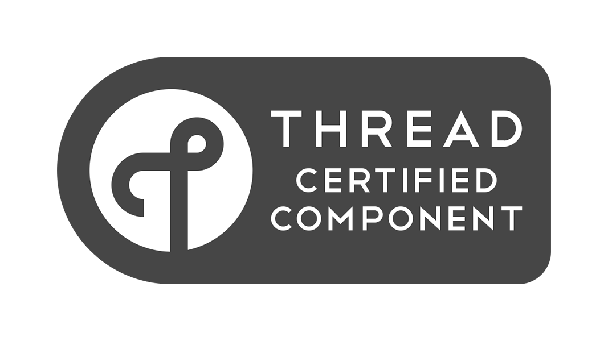
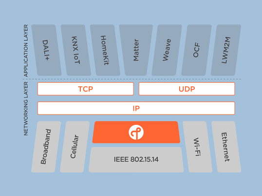
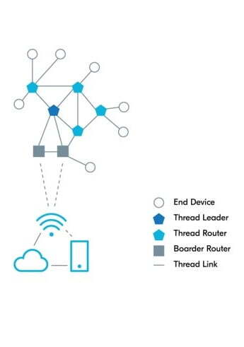

# Thread에 대하여

## Thread? 그거 병렬처리 할때 쓰는거 아니야?

보통 Thread라 하면 프로세스 내에 실행되는 task의 단위로 많이들 알 것이다.  
하지만 IoT 세계에서는 의미가 완전 다르다. 이를 한 번 설명해보고자한다.  

---

## Thread란?

Thread는 [threadgroup](threadgroup.org)에서 만든 
IPv6 기반 저전력 무선 메쉬 네트워크이다.

## Thread의 특징
1. **Secure / 안전성**  
   데이터 전송과 commissioning에 대한 보안 체계를 갖추고있고 IP 기반 프로토콜이어서 IP에서 제공하는 보안 특성을 그대로 가져가기 때문이다.
2. **Scalable / 확장성**  
   Mesh의 네트워크 커버리지를 확장 가능한 특성을 사용할 수 있고, IP기반 네트워크이기 때문에 IP기반 다른 큰 네트워크에 연결되어 확장될 수 있다.
3. **Reliable / 신뢰가능한**  
   Mesh를 지원하기 때문에 Single point of failure(단일 지점 장애)에 거의 영향을 받지않는다. 따라서 특정 디바이스에서 문제가 생겼을때 다른 디바이스를 통해 안정적으로 통신이 가능하다.
4. **Seamless / 변환작업이 없는**  
   Zigbee나 Z-Wave의 경우 허브장치들이 주소 변환작업을 해줘야 IP기반 네트워크에 연결이 가능하다.  
   하지만 Thread는 클라우드부터 디바이스까지 IP기반으로 통신하기에 다른 프로토콜을 연결하거나 변경할 필요가 없다.

즉, 저전력 기기들에게 확장성과 안전성을 부여하고 장비 구성을 심플하게 구성할 수 있는 특징들을 가지고 있다.  

현재 Google에서 Thread의 오픈소스 SDK인 [OpenThread](openthread.io)를 출시하였다.

## Thread의 구조는?

위 그림은 Thread의 스택 구조를 보여준다.  
Thread는 Network 인터페이스 계층을 가지며 그 중 datalink Layer에 속한다.  
IPv6를 사용하며 Zigbee와 동일한 IEEE 802.15.14 표준을 사용한다.  

## Thread의 네트워크 구조와 역할

Thread Device는 네 가지 종류로 분류된다.
- **Thread Router**  
  Mesh 네트워크를 구성하며 네트워크 내에 있는 End Device들에게 Routing(Network Join, Security 기능 제공) 기능을 제공한다.  
  Mesh를 구성할 수 있는 라우터의 개수는 최대 64개이다.(이 이상일 경우 Router Enabled End Points가 되어 특정 라우터에 장애가 생기면 Router 역할을 하게된다.)  
  Zigbee와 다르게 디바이스 본연의 기능도 동시에 수행한다.
- **End Device**  
  가장 끝단에 위치해있으며 디바이스 본연의 기능을 수행한다.
- **Thread Leader**  
  가장 먼저 Thread 네트워크에 접속한 장치이다. 라우터들을 관리하는 마스터 역할을 한다.
- **Thread Border Router**  
  Thread 네트워크를 다른 네트워크와 연결시켜주는 역할을 한다. 이 장치들로 Thread 네트워크와 다른 네트워크를 IP 기반으로 연결할 수 있게 해준다.
  현재 Google의 OpenThread에서 docker, raspberrypi 등 쉽게 사용할 수 있도록 제공되어있다.

## Zigbee와의 공통점과 차이점  

**공통점**
1. IEEE 802.15.4 표준을 사용
2. 동일한 PHY/MAC을 사용. 따라서 한 칩셋에서 Thread와 Zigbee를 동시에 지원하는 경우가 있음.

**차이점**
1. 제어 방식의 차이
   Zigbee : Zigbee Coordinator(Zigbee Hub)가 네트워크 전반을 관할
   Thread : 각 Thread Router들이 돌아가며 관할.
2. IPv6 지원 유무
   Zigbee : X (Zigbee 3.0에서는 지원 예정)
   Thread : O

## 현 시장에서 Thread를 지원하는 장치는?

- Apple HomePod Mini
- Apple TV 4K (2021)
- eero 6
- eero Pro 6
- Eve Energy smart plug
- Eve Light Switch (EU)
- Eve Window and Door sensors
- Eve Aqua
- Google Nest WiFi
- Google Nest Hub Max
- Nanoleaf Essential A19 smart bulb
- Nanoleaf Essentials smart light strip
