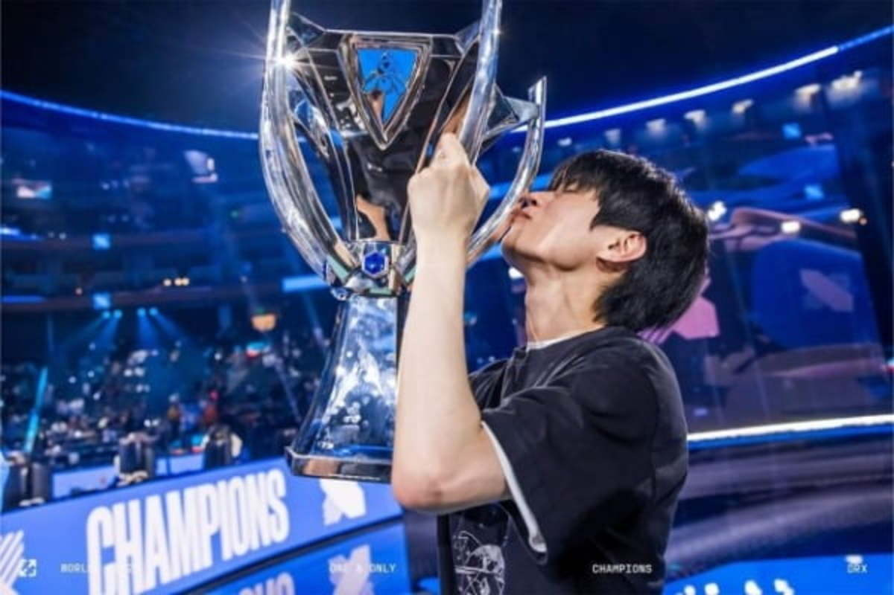

# 6개월 만에 돌아왔다.

어떤 POC 프로젝트를 맡게 되어 일에 집중했던 타이밍이었다.
돌이켜보면 6개월간 엄청난 일들이 있었구나 생각이 든다.

## 이전 글에 써있던 내용들 중 변화된 내용  

  
1. 데프트가 2022 롤드컵을 우승했었다.  무려 3505일만에.
	- 결승은 영등포 CGV에서 T1팬 학교후배, 제3자 여자친구, 데프트팬 나  이렇게 셋이서 봤다.
	- 끝나고 점심먹으려 했는데 5세트 접전을 해서 3시반에 경기가 끝났다. 근데 막상 밥먹으려하니까 나와 후배가 서로 오열을 하고있어서 밥먹을 분위기가 되지않아 각자 집으로 가기로했다.. 그때입고간 후리스에 눈물 콧물 다 쏟았고 그날 기뻐서 소주 3병 마시고 뻗었다.
	- 지금은 데프트가 담원으로 이적했고 그의 롤드컵 행보에 맞은 "중요한건 꺾이지않는 마음"이 월드컵을 타고 완전 대중적으로 유행하게 되었다.  
	- 이 이후 월드컵에서 메시가 우승을 하면서 2022년은 홍진호가 현역이었으면 우승했을법한 성불의 해 라는 밈이 돌았다.
	- 나에게 있어 데프트란 20년도 대인기피증을 앓았을때 바깥을 나오게 해준 사람이다. 나에게 회복할 수있게 영향력을 주었던 사람이 원하던것을 얻으니 참 기뻤다.
	- 2022 롤드컵 주제가 star walkin 노래가 있는데 이전에 들었을때는 별로 감흥이 없었는데 우승 하고 나서 들으니까 참 소름도 돋고 눈물날거같다. 아직도 그런다
	- 우승한지 5개월이 지난 지금에도 8강 EDG전과 우승컵 들어올리는 모습보면 눈물이 난다. 이번 일본 출장가면서 롤드컵 결산 영상 다운받아 봤는데 볼때마다 울어서 옆사람이 달래줬었다.

2. 2년 반 동안 살았던 숭실대를 떠나고 현재 성동구 금호동에 전세로 이사했다.
	- 첫 자취 시작이었던 숭실대 원룸방을 나왔다. 여자친구와 같이 살게 되니까 2명분이 감당이 안되는 방크기여서 이사를 결정했다.
	- 여자친구가 한 번도 혼자 자취를 한 적이 없어서 금전적인 부분에 조금 다투었다. 시간 쪼개서 은행에 상담 받아보라했고 내 의도를 이해할 수 있다고 했었다.
	- 피터팬 직거래, 2억 14평 투룸 전세, 이사비+중개비 총 40만원. 직장인 신사역 근처까지 door to door 30분인데 정말 싸게 했다.
	- 현재는 신용대출 25% + 청년버팀목 75%로 되어있어서 매달 80만원씩 이자가 나가는데  SH 장기안심주택이 당첨되면 신용대출을 다 털 수 있을것이다. 그러면 월이자가 20만원으로 줄어드는 기적을 볼수있다.

3. 저축을 2천만원 까지 했다. 돈 모은지 이제 1년 거의 다 되는데 좋은 시작이라 생각한다. 
4. 살이 엄청 쪘다. 학교에서 다니던 헬스장은 장마때 침수되고 나서 복구하지못하고 11월에 운영중지 12월 폐업수순을 밟게 되어 운동을 전혀하지않았다. 10월과 비교하면 9키로 정도 더 찐거같다.

5. 테크 제품들이 여러번 바뀌었다. 
	- 아이폰과 애플워치에 불많이 많았고 생각보다 애플 생태계 연동이 그렇게 강력하지 않다는게 컸다. M1맥북에어 처분을 처음으로 아이패드 프로 12.9 3세대, 에어팟 프로, 아이폰을 전부 처분하였다.
	- 아이폰은 알림 센터 보는 제스처가 불편했고 애플워치는 헬스 위주 운동을 하는 나에게 운동 횟수 세주는 기능이 없어 불편했다
	- 현재는 XPS13 9300과 갤럭시 S23울트라, 버즈2, 갤럭시워치4 클래식을 쓰고있다. 

6. 정신과를 안가게 되었다
	- 작년까지만 해도 불면증과 대인기피증이 심했는데 요새는 아예 없어진듯하다.
	- 투약도 달마다 약을 먹긴했는데 지금은 약 끊은지 3달이 지났다. 가볍다.

## 새로 시작했던 것들
1.  일본의 LIXIL 사의 mirabo lab의 POC 시나리오 출장을 갔었다.
	- 처음 진행했을때 허브와 IR리모컨을 제공받아 IR리모컨으로 TV와 에어컨을 제어하는 시나리오를 만들었었다.
	- 하지만 2월초에 출장가보니 전등들과 에어컨이 echonet lite 라는 특수한 프로토콜을 사용하고있었고 TV는 설치되지않았으며, 전동셔터의 경우 RF방식으로 제어되고있었다.
	- 출장 당일 하루 꼬박 밤을 샜다. 도요타 통상 번역 임 대리님께 참 죄송했다. 임대리님 남편분이 고열에 있을때 그랬으니....ㅠㅠㅠ... 다시 생각해도 죄송하다
	- 작업은 이틀 후다닥 끝냈고 하드웨어 이슈가 하나 있어 3월에 한번 더 갔었다. 이때 에어컨 온도, 바람 까지 조절 가능하도록 만들어놨다.
	- 단순히 api만 붙여서 이렇게 됐지만 제품 양산으로 가게된다면 회사 백엔드 서버를 개설하거나 IFTTT 같은 서비스에 붙여야할거같다. 비용은 좀 들거같다.

2. 회사 개발용 우분투 리포지토리를 팠다.
	- 전부터 하고싶었지만 어떻게 하는 지 몰랐는데 생각보다 쉬워서 당황했다. 
	- aptly, deb 정적호스팅 등등 다양한 삽질을 했고 aws s3 + reprepro 조합으로 배포를 시작했다.
	- 이 프로젝트로 인해 AWS S3를 따로 공부하게 되었다. 또한 CICD에 대해 좀 더 깊게 공부해야겠다는 생각이 든다.
3. 구립도서관을 가기 시작했다.
	- 전셋집으로 넘어오면서 원했던것은 저축자금을 늘리는 것이었다. 특히 고금리 시대에 저축은행 상품중에 5퍼센트 넘는 상품들이 많다. 이를 잘 활용해서 분산 저축을 하는 것이 목표였고 그 중 제일 많이 썼던 카페 값을 줄이려고 했다.
	-  전셋집 근처에 구립금호도서관이 있었고 재택근무할때 여기를 자주 이용한다. 평일에는 사람들이 많이 없어 딱 좋은거같다.

## 마침글
- 눈 깜짝 할 새에 6개월이 지나갔는데 생각보다 많은것이 바뀌어있어서 놀랬다.
- 배운것도 많았고 잊어버린것도 많은 것 같다. 사람과 기술적인건 잊어버리지 않았으면 좋겠다.
- 이번 4월에도 또 토익을 보는데 이번엔 정말 실수 안하고 잘봤으면 좋겠다. 